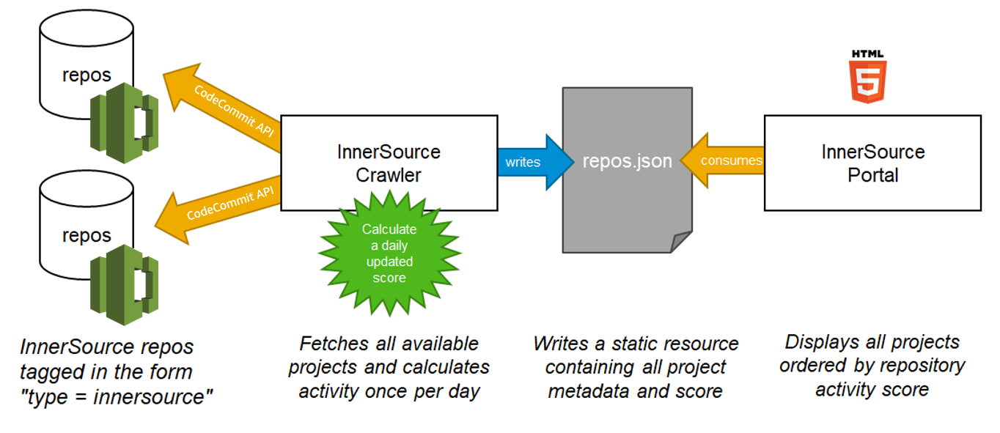

# AWS CodeCommit Crawler for InnerSource Portal
Organizations setting up an [InnerSource](https://innersourcecommons.org/) ecosystem in their intranet should be able to use any [Source Code Control system](https://en.wikipedia.org/wiki/Source_Code_Control_System). This project assists in setting up a crawler for [AWS CodeCommit](https://aws.amazon.com/codecommit/) based InnerSource code repositories that can be utilized by the [SAP InnerSource Portal](https://github.com/sap/project-portal-for-InnerSource). The crawler can made to fetch these details automatically every once a while using [cron](https://en.wikipedia.org/wiki/Cron) construct. [Click here](https://github.com/SAP/project-portal-for-innersource/blob/main/docs/CRAWLING.md) to know more about the Crawler.

The project creates a `repos.json` to be consumed by the [SAP InnerSource Portal](https://github.com/sap/project-portal-for-InnerSource) to display available InnerSource projects. The solution assumes that you have the CodeCommit repositories already setup and that the crawler is able to connect to them using AWS credentials (namely, *aws_access_key_id* and *aws_secret_access_key*). 

The crawler implements a custom logic for assigning the  [activity score](https://patterns.innersourcecommons.org/p/repository-activity-score) and omits the fields that are not available/relevant for CodeCommit (e.g. *Fork* or *Star*).

## Installation

    pip install -r requirements.txt

## Usage

1. (Optional) Add a tag to your InnerSource repos with key as `type` and value as `innersource`
2. (Optional) Add an `innersource.json` file in each repo (a sample file is included in this repo), with the details about the project.
3. Run `python3 ./crawler.py`, which will create a `repos.json` file containing the relevant metadata for the AWS CodeCommit repos
4. Copy `repos.json` to your instance of the SAP InnerSource Portal and launch the portal as outlined in their installation instructions.

## Customization
While the entire code can be customized according to your use case, a particular customization might be needed if your AWS CodeCommit installation contains repositories other than the InnerSource repos. In such a case you may want to filter out the InnerSource ones using tags, such as `type = innersource`. An example code to implement this filter is provided:

    tag_data = cc_client.list_tags_for_resource(
    	resourceArn = repo_metadata["Arn"]
    )
    repo_tags = tag_data["tags"]
    repoType = repo_tags["type"]
    if repoType != "innersource":
    	break

Similarly, you may chose to add an `innersource.json` file in each of your InnerSource repo (a sample file is included in this repo), with the details about the project. This helps in populating the fields on the portal information of which cannot be fetched from CodeCommit.

## Security

See [CONTRIBUTING](CONTRIBUTING.md#security-issue-notifications) for more information.

## License

This library is licensed under the MIT-0 License. See the LICENSE file.